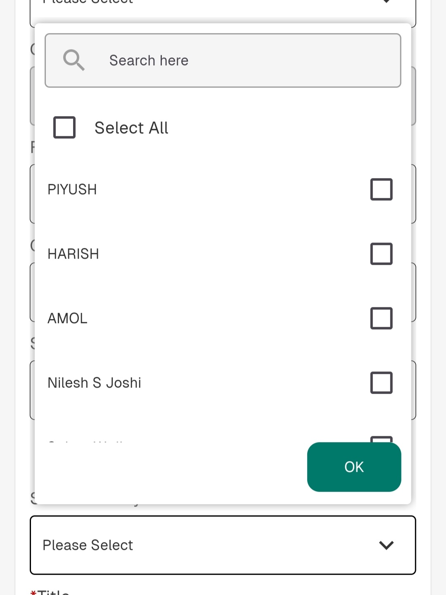

# Advance Dropdown Plus

An advanced Flutter dropdown widget that provides enhanced functionality beyond the standard dropdown. Features multi-selection, search capabilities, customizable styling, and robust validation.

## Features

✨ **Multi-Selection Support** - Select multiple items with checkboxes
🔍 **Search Functionality** - Built-in search to filter dropdown options
🎨 **Customizable Styling** - Extensive theming and styling options
✅ **Validation Support** - Form validation with custom validators
🎯 **Select All Option** - Convenient select/deselect all functionality
🎮 **Controller-Based** - Reactive state management with controllers
📱 **Responsive Design** - Works seamlessly across different screen sizes

## Getting Started

Add this package to your `pubspec.yaml`:

```yaml
dependencies:
  advance_dropdown_plus: ^1.0.0
```

Then run:
```bash
flutter pub get
```

Import the package:
```dart
import 'package:advance_dropdown_plus/advance_dropdown_plus.dart';
```

## Usage

### Single Selection Dropdown

```dart
final singleController = SingleValueDropDownController();

DropdownField(
          controller: singleController,
          dropDownList: [
            DropDownValueModel(name: 'Option 1', value: 'option1'),
            DropDownValueModel(name: 'Option 2', value: 'option2'),
            DropDownValueModel(name: 'Option 3', value: 'option3'),
          ],
          textFieldDecoration: const InputDecoration(
            labelText: "Select an Option",
            border: OutlineInputBorder(),
          ),
          onChanged: (selectedItem) {
            print("Selected: ${selectedItem.name}");
          },
        ),
```

### Multi-Selection Dropdown

```dart
final multiController = MultiValueDropDownController();

//DropDownValue model list
  final List<DropDownValueModel> sportsOptions = [
    DropDownValueModel(name: 'Football', value: 'football'),
    DropDownValueModel(name: 'Cricket', value: 'cricket'),
    DropDownValueModel(name: 'Basketball', value: 'basketball'),
    DropDownValueModel(name: 'Tennis', value: 'tennis'),
    DropDownValueModel(name: 'Swimming', value: 'swimming'),
  ];

  void changeSelection(DropDownValueModel value, bool isCheck, int index) {
    if (isCheck) {
      value.isSelected.value = true;
    } else {
      value.isSelected.value = false;
    }
  }
       // Dropdown field from the package
            DropdownField.multiSelection(
              controller: multiController,
              dropDownList: sportsOptions,
              isSelectAll: true,
              displayCompleteItem: true,
              submitButtonText: "Submit",
              submitButtonColor: Colors.blue,
              submitButtonTextStyle: const TextStyle(color: Colors.white),
              textFieldDecoration: const InputDecoration(
                labelText: "Select Sports (Package Dropdown)",
                border: OutlineInputBorder(),
              ),
              onCheckChange: (model, isCheck, index) {
                changeSelection(model, isCheck, index);
              },
              onChanged: (selectedList) {
                print(
                  "Package Dropdown - Selected Items: ${selectedList.map((e) => e.name).join(', ')}",
                );
              },
            ),
```

### With Search Functionality

```dart
     DropdownField.multiSelection(
              enableSearch: true,
              controller: multiController,
              dropDownList: sportsOptions,
              isSelectAll: true,
              displayCompleteItem: true,
              submitButtonText: "Submit",
              submitButtonColor: Colors.blue,
              submitButtonTextStyle: const TextStyle(color: Colors.white),
              textFieldDecoration: const InputDecoration(
                labelText: "Select Sports (Package Dropdown)",
                border: OutlineInputBorder(),
              ),
              onCheckChange: (model, isCheck, index) {
                changeSelection(model, isCheck, index);
              },
              onChanged: (selectedList) {
                print(
                  "Package Dropdown - Selected Items: ${selectedList.map((e) => e.name).join(', ')}",
                );
              },
            ),


```

## Customization Options

- **Styling**: Customize colors, fonts, borders, and spacing
- **Icons**: Custom dropdown and clear icons
- **Validation**: Built-in form validation support
- **Search**: Configurable search with custom styling
- **Animations**: Smooth dropdown animations
- **Accessibility**: Full accessibility support

## Screenshots

Here are some screenshots showcasing the advance dropdown functionality:

### Single Selection Dropdown


### Multi-Selection Dropdown


### Search Functionality


### Select All Feature


### Customized Styling


## Example

Check out the `/example` folder for complete working examples of both single and multi-selection dropdowns.

## Contributors

This package was developed and maintained by:

- **Pranay Pathrabe** - (Developer)
- **Amol Gahukar** ([@amolgahukar10](https://github.com/amolgahukar10)) - (Lead Developer & Architect)

Special thanks to all contributors who helped make this package better!

## Contributing

Contributions are welcome! Please feel free to submit a Pull Request.

## License

This project is licensed under the MIT License - see the [LICENSE](LICENSE) file for details.

## Issues

Please file feature requests and bugs at the [issue tracker](https://github.com/pranay311/advance_dropdown_plus/issues).
